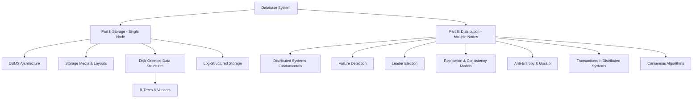

# Database Internals — Structure of the Book

> **Purpose of this note**
> This document acts as a **conceptual map** of the book *Database Internals*. It is not a summary of chapters, but a guide to *how the ideas are organized* and *why the book is structured this way*.

The book explains databases by focusing on the **two hardest and most differentiating problems**:

* How data is **stored** (single node)
* How data is **distributed** (multiple nodes)

Everything else is considered secondary for the purpose of understanding database internals.

---

## High-Level Map

```
Database System
│
├── Part I: Storage (Single Node)
│   ├── DBMS Architecture
│   ├── Storage Media & Layouts
│   ├── Disk-Oriented Data Structures
│   │   └── B-Trees & Variants
│   └── Log-Structured Storage
│
└── Part II: Distribution (Multiple Nodes)
    ├── Distributed Systems Fundamentals
    ├── Failure Detection
    ├── Leader Election
    ├── Replication & Consistency Models
    ├── Anti-Entropy & Gossip
    ├── Transactions in Distributed Systems
    └── Consensus Algorithms
```


This map should be kept in mind while reading every chapter.

---

## Why This Structure?

Databases expose many features (SQL, indexes, transactions, APIs), but **most real-world differences between database systems come from two design axes**:

1. **Storage** — how data is laid out, written, read, and recovered on a single node
2. **Distribution** — how data is replicated, coordinated, and kept consistent across nodes

Other subsystems (query execution, transport, parsing) matter, but they are not the primary focus of this book.

---

## Part I — Storage Engines (Node-Local Perspective)

### Scope

* Focuses on **single-node behavior**
* Treats the storage engine as the **central and most distinctive component** of a DBMS

### Conceptual Progression

1. **DBMS Architecture**

   * Position of the storage engine inside a database system
   * Classification of databases by storage medium and layout

2. **Storage Structures**

   * Differences between in-memory and disk-based data structures
   * Why disk-oriented structures require different algorithms

3. **B-Trees and Their Variants**

   * On-disk representation
   * Page layout and serialization
   * Page splits, merges, and rebalancing
   * Variants inspired by B-Trees

4. **Log-Structured Storage**

   * Motivation for append-only designs
   * Trade-offs between read and write optimization
   * Use cases in file systems and storage engines

### Goal of Part I

> To understand how databases **physically store data**, survive failures, and manage performance under hardware constraints.

---

## Part II — Distribution (Cluster Perspective)

### Scope

* Focuses on **multi-node systems**
* Explores why distributed databases are fundamentally harder than single-node ones

### Conceptual Progression

1. **Distributed Systems Foundations**

   * Failure modes
   * Network unreliability
   * Partial failures

2. **Failure Detection**

   * Detecting crashed or unreachable nodes
   * Improving stability and performance

3. **Leader Election**

   * Why leadership is required
   * Algorithms and trade-offs

4. **Replication & Consistency**

   * Consistency models
   * Replica divergence
   * Eventual consistency

5. **Anti-Entropy & Gossip**

   * Replica convergence
   * Data dissemination strategies

6. **Transactions & Consensus**

   * Logical consistency in distributed systems
   * Consensus algorithms

### Goal of Part II

> To understand how databases remain **correct, available, and consistent** when data is spread across machines.

---

## Research-Driven Design

* The book heavily references academic papers
* References are meant as **entry points for deeper study**
* Each chapter ends with:

  * A summary
  * Suggestions for further reading

This reinforces that database engineering is a **research-informed discipline**, not just implementation work.

---

## One-Sentence Mental Model

> *Database Internals* explains databases by decomposing them into their two most difficult problems: **how data is stored on a single node** and **how data is coordinated across many nodes** - distribution part, emphasizing trade-offs over optimal solutions.

---

